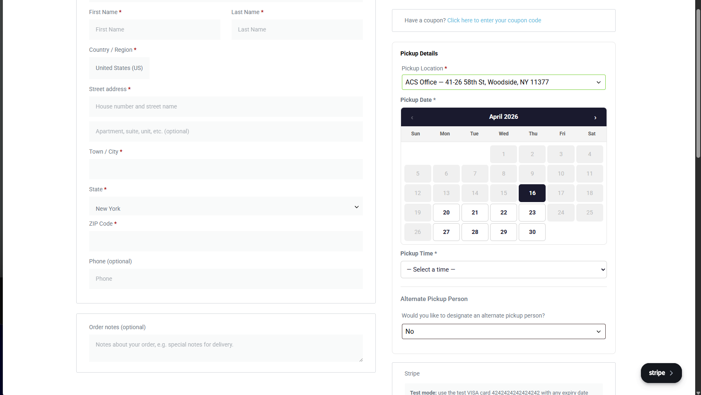
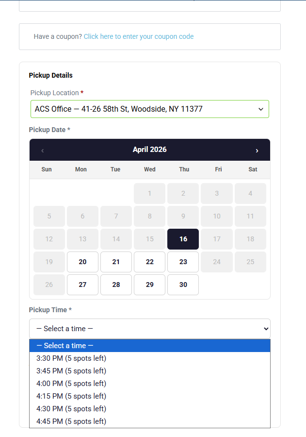
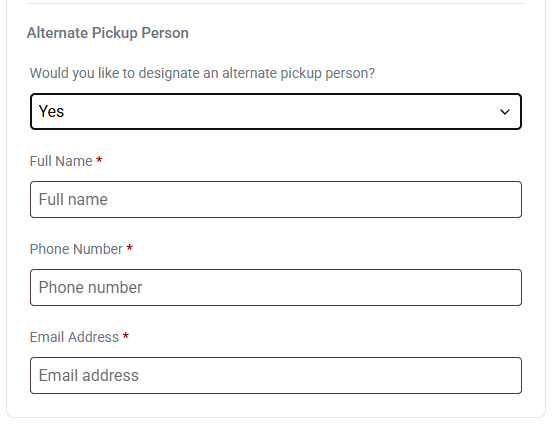
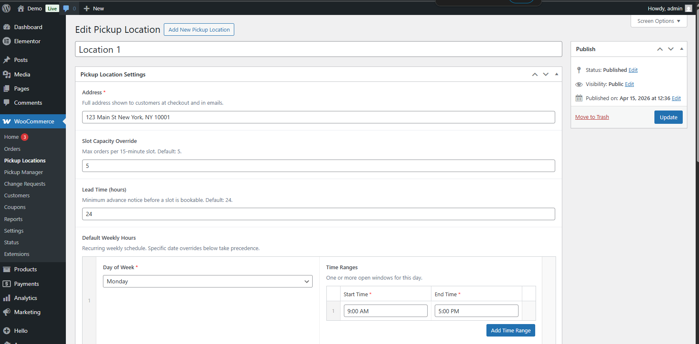
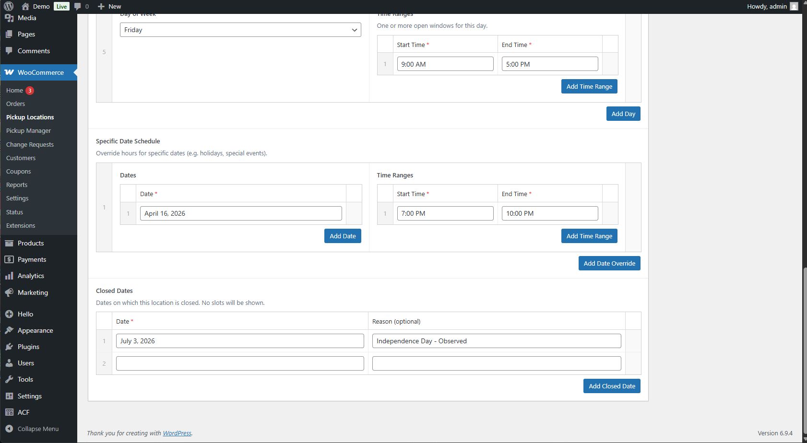
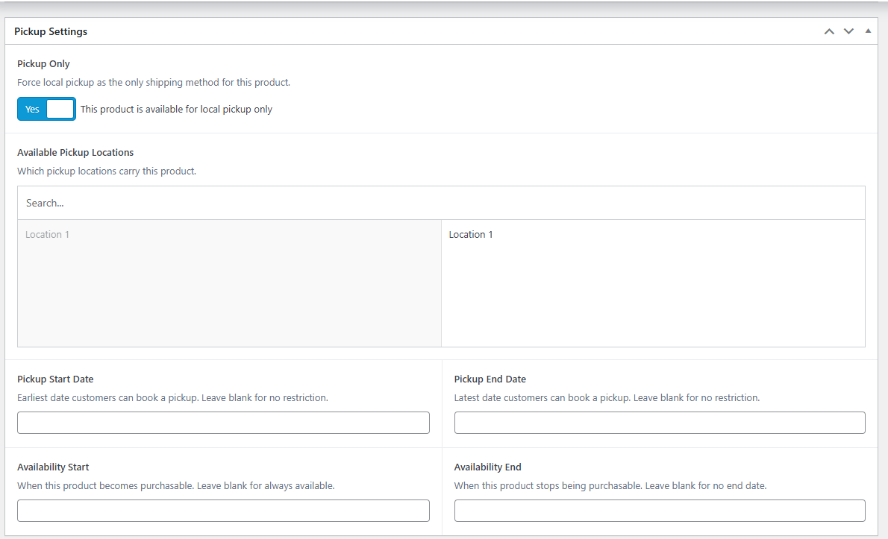
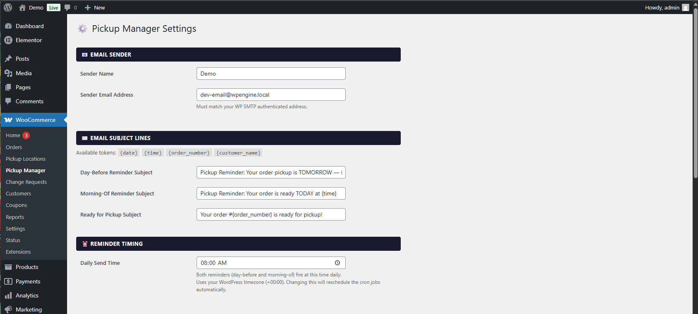
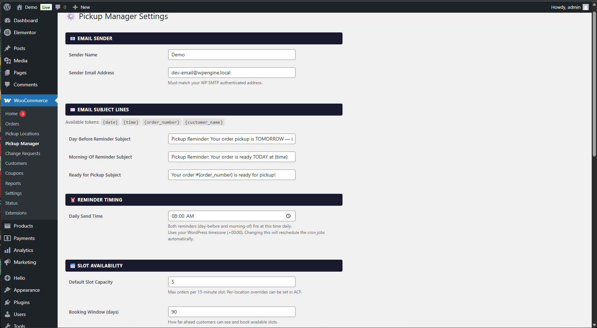
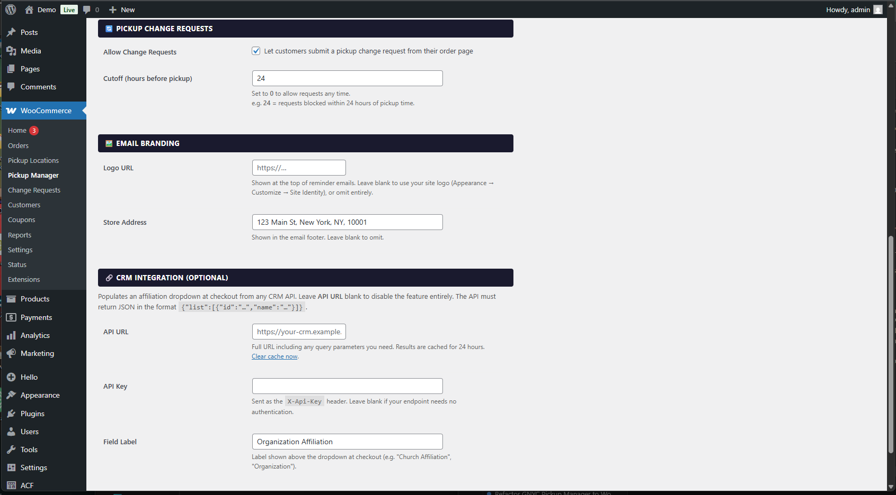

# WooCommerce Local Pickup Manager

Advanced local pickup scheduling for WooCommerce. Instead of a plain "local pickup" option at checkout, customers choose a specific location, date, and time slot — with real-time availability driven by per-location schedules and capacity limits.

---

## Features

- **Slot-based scheduling** — 15-minute pickup slots with configurable capacity per location
- **Live availability calendar** — customers pick a date and time at checkout with real-time slot counts
- **Per-location schedules** — recurring weekly hours, specific date overrides, and closed dates
- **Automated reminder emails** — day-before and morning-of reminders via WP Cron
- **"Ready for Pickup" order status** — custom status with customer email notification
- **Pickup change requests** — customers can request changes from their order page; reviewed in WP Admin
- **Seasonal product availability** — restrict products to date ranges, recurring or one-time
- **Alternate pickup person** — customers can designate someone else to collect their order
- **CRM group affiliation** — optional dropdown at checkout pulling from any JSON API (hidden when unconfigured)
- **Mixed cart prevention** — pickup-only products cannot be combined with shippable products
- **Admin settings panel** — email branding, slot capacity, booking window, change request cutoffs, CRM integration

---

## Screenshots

### Checkout

### Pickup Locations

### Product Settings

### Plugin Settings

---

## Requirements

| Dependency | Required | Notes |
|---|---|---|
| WordPress | 6.0+ | |
| WooCommerce | 7.0+ | Hard requirement — plugin deactivates without it |
| PHP | 7.4+ | |
| ACF Pro | **Required** | Currently required for the field UI on pickup locations and products. Work is in progress to replace this with native WordPress meta boxes so ACF Pro will become optional in a future release. |
| Elementor Pro | **Required** | Currently required for the seasonal availability feature. Work is in progress to implement this via standard WooCommerce hooks so Elementor Pro will become optional in a future release. |
| WP SMTP (or equivalent) | Recommended | Required for reliable email delivery |

---

## Installation

1. Upload the `woocommerce-local-pickup-manager` folder to `/wp-content/plugins/`.
2. Activate the plugin through **Plugins → Installed Plugins**.
3. Add **Local Pickup (Manager)** as a shipping method in **WooCommerce → Settings → Shipping → [your zone]**.
4. Create pickup locations under **WooCommerce → Pickup Locations**.
5. Configure plugin settings under **WooCommerce → Pickup Manager**.

---

## Pickup Locations

Each pickup location is a custom post type with the following fields:

| Field | Description |
|---|---|
| Address | Shown to customers at checkout and in emails |
| Slot Capacity Override | Max orders per 15-min slot (falls back to global default) |
| Lead Time (hours) | Minimum advance notice before a slot is bookable |
| Default Weekly Hours | Recurring schedule by day of week |
| Specific Date Schedule | Date-specific hour overrides (holidays, special events) |
| Closed Dates | Dates with no available slots |

---

## Product Settings

On any WooCommerce product:

| Field | Description |
|---|---|
| Pickup Only | Forces local pickup as the only shipping method |
| Available Pickup Locations | Which locations carry this product (shown when Pickup Only is on) |
| Pickup Start / End Date | Restricts bookable pickup dates for this product |
| Availability Start / End | Controls when the product is purchasable |
| Expires After End Date | One-time expiry vs. annual recurrence |

---

## Settings

Configure under **WooCommerce → Pickup Manager**:

| Setting | Default | Description |
|---|---|---|
| From Email | WP admin email | Sender address for all plugin emails |
| From Name | Site name | Sender display name |
| Email Logo URL | _(blank)_ | Falls back to WP site logo, or omitted |
| Store Address | WC store address | Shown in email footer; omitted when blank |
| Reminder Send Time | 08:00 | Daily cron fire time (HH:MM, site timezone) |
| Day-Before Reminder Subject | _(template)_ | Tokens: `{date}` `{time}` `{order_number}` `{customer_name}` |
| Morning-Of Reminder Subject | _(template)_ | Same tokens |
| Ready for Pickup Subject | _(template)_ | Same tokens |
| Default Slot Capacity | 5 | Orders per 15-min slot (per-location field overrides this) |
| Booking Window | 90 days | How far ahead customers can book |
| Allow Change Requests | On | Show change request form on the order page |
| Change Request Cutoff | 24 hours | Block requests within N hours of pickup (0 = always allow) |
| CRM API URL | _(blank)_ | Full URL returning `{"list":[{"id":"…","name":"…"}]}`. Leave blank to disable the affiliation dropdown. |
| CRM API Key | _(blank)_ | Sent as `X-Api-Key` header |
| CRM Group Label | Organization Affiliation | Label for the dropdown at checkout |

---

## ACF Pro — Current Requirement (Removal In Progress)

**ACF Pro is currently required.** Pickup location and product fields are managed through ACF's repeater and relationship UI, registered programmatically — no JSON import needed.

Work is in progress to replace the ACF dependency with native WordPress meta boxes. Once complete, ACF Pro will become fully optional: when active it will continue to provide the polished repeater UI; when absent, the plugin will fall back to native meta boxes automatically with no data loss.

---

## Elementor Pro — Current Requirement (Removal In Progress)

**Elementor Pro is currently required** for the seasonal availability feature. The plugin hooks into Elementor Pro to hide the add-to-cart widget for out-of-season products and replace it with an availability message.

Work is in progress to implement this feature via standard WooCommerce hooks so it works with all themes. Once complete, Elementor Pro will become optional — when detected, the Elementor-specific widget enhancement will still activate automatically.

---

## Order Meta Keys

| Key | Value |
|---|---|
| `_pickup_selections` | Serialized array: location, date, time, products |
| `_church_affiliation_id` | CRM group ID (if CRM integration is configured) |
| `_church_affiliation_name` | CRM group display name |
| `_has_alternate_pickup` | `yes` or `no` |
| `_alternate_pickup_name` | Text |
| `_alternate_pickup_phone` | Text |
| `_alternate_pickup_email` | Email |

---

## License

GPL-2.0+. See [LICENSE](LICENSE).
